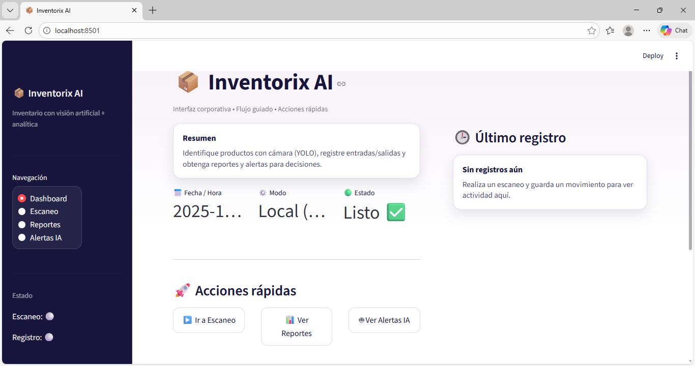
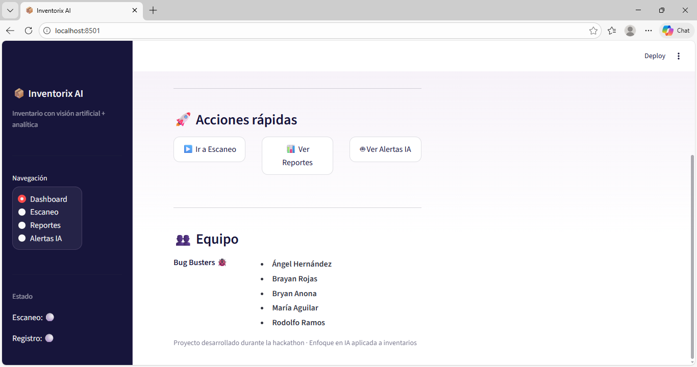
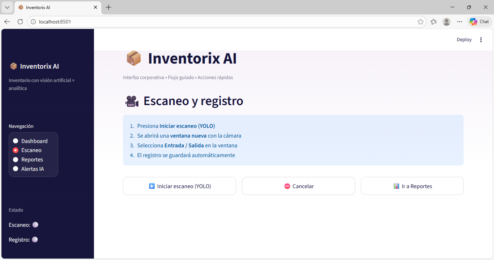
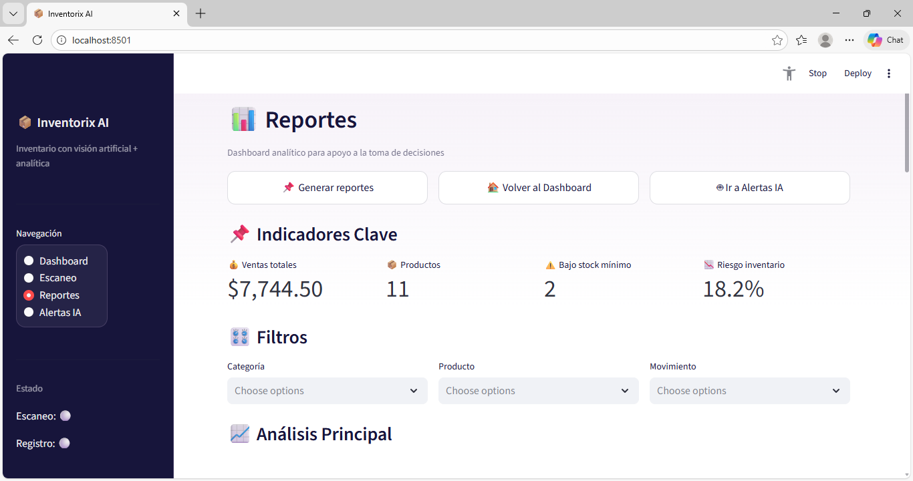
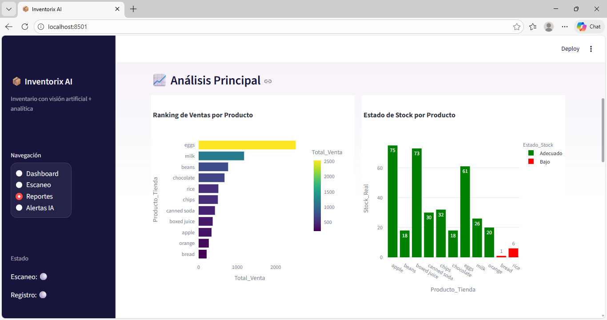
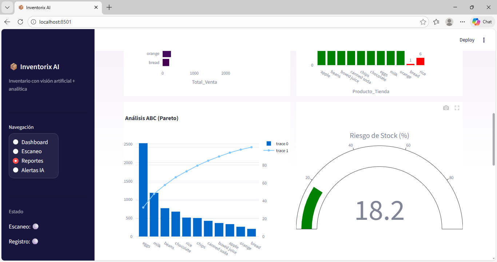
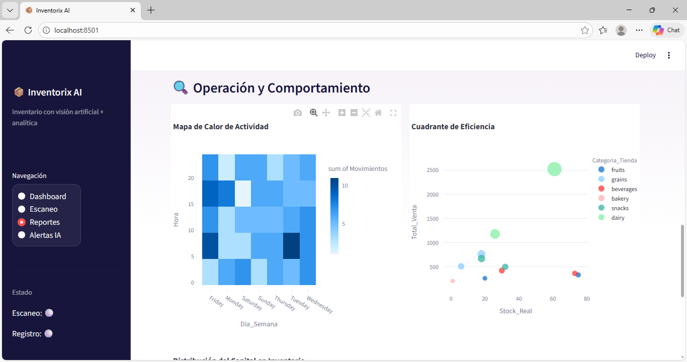
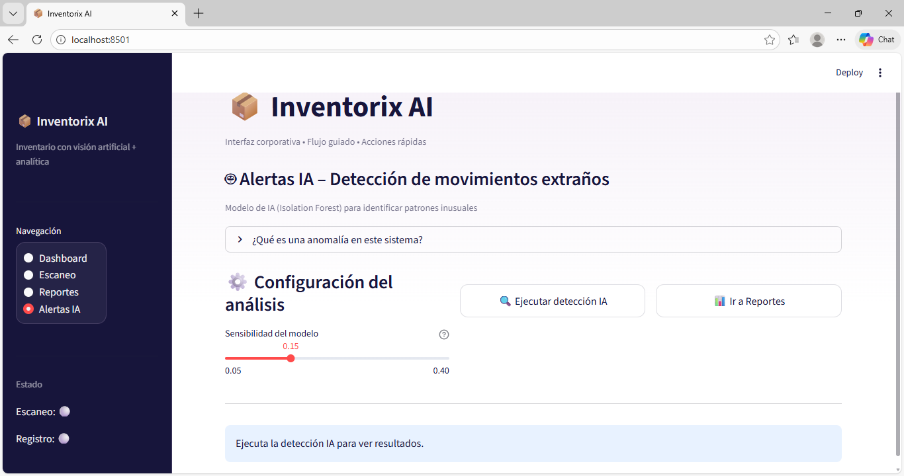
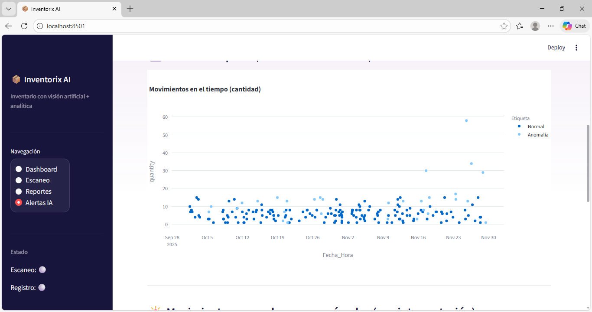
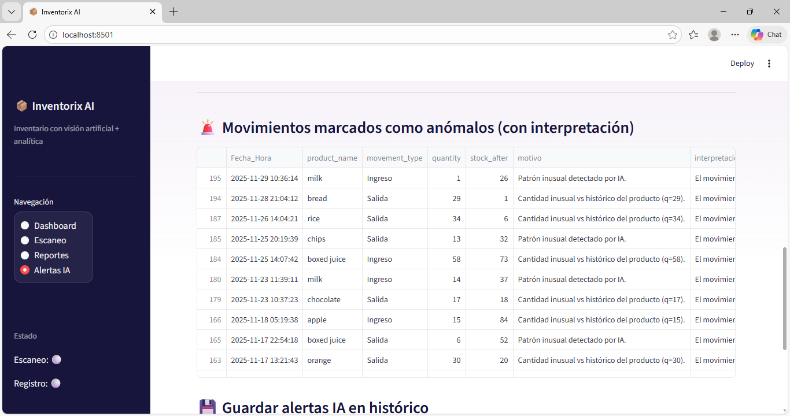

# 📦 Inventorix AI: Sistema Inteligente de Gestión de Inventario

**Equipo:** Bugs Busters\
**Integrantes:** Bryan Anona, Brayan Rojas, Rodolfo Ramos, Ángel
Hernández, María Aguilar

## Planteamiento del Problema

La gestión manual de inventarios es lenta, propensa a errores y demanda
demasiado tiempo operativo. Registrar entradas/salidas, identificar
productos visualmente y monitorear el stock mínimo consume recursos y
ocasiona fallos humanos, afectando la eficiencia del negocio.

## Objetivos

### General

Automatizar el control de inventarios mediante visión artificial y
analítica avanzada, permitiendo identificar productos visualmente,
registrar movimientos y generar reportes inteligentes.

### Específicos

-   Detectar productos mediante un modelo YOLO utilizando una cámara en
    tiempo real.
-   Registrar automáticamente entradas o salidas del inventario.
-   Procesar y estandarizar el historial para análisis.
-   Producir reportes interactivos que faciliten decisiones operativas.

## Herramientas Utilizadas

-   **Python**
-   **Streamlit**
-   **OpenCV**, **Ultralytics YOLO**
-   **Pandas**, **NumPy**
-   **Plotly**
-   **nbformat**

## Estructura del Proyecto
```
InventorixAI/
├── data/
│   ├── __init__.py
│   ├── historial.json
│   └── inventario.json
│
├── src/
│   ├── analytics/
│   │   ├── __init__.py
│   │   ├── analytics.py
│   │   └── anomalias.py
│   │
│   ├── backend/
│   │   ├── __init__.py
│   │   ├── graficas.py
│   │   ├── guardar_anomalias.py
│   │   ├── obtener_historial.py
│   │   └── registrar_movimiento.py
│   │
│   ├── frontend/
│   │   ├── __init__.py
│   │   ├── app_frontend.py
│   │   ├── styles.py
│   │   └── ui_components.py   
│   │
│   ├── vision/
│   │   ├── __init__.py
│   │   ├── detectar_producto_ui.py
│   │   ├── detectar_producto.py
│   │   └── vision_model.py
│   │
│   └── __init__.py
│   
│
├── README.md
└── requirements.txt
```
## Instalación y Configuración

### Clonar

``` bash
git clone https://github.com/SIC-GruposGT05-06-2025/sic-proyectos-grupo-11.git
cd sic-proyectos-grupo-11/proyecto_2_modulo_IA

```

### Dependencias

``` bash
pip install -r requirements.txt
```

### Ejecutar

``` bash
streamlit run src/frontend/app_frontend.py
```

## Uso del Sistema

### Escaneo y Registro

-   Detección visual con YOLO
-   Registro de movimientos

### Análisis y Reportes

-   Ranking de ventas\
-   Alertas de stock\
-   Mapa de calor\
-   Pareto ABC\
-   Sunburst\
-   Indicador de riesgo

---
## 📸 Capturas del sistema en ejecución

### Dashboard principal



### Detección de productos con cámara



### Reportes de inventario





### Análisis de anomalías


